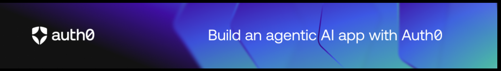
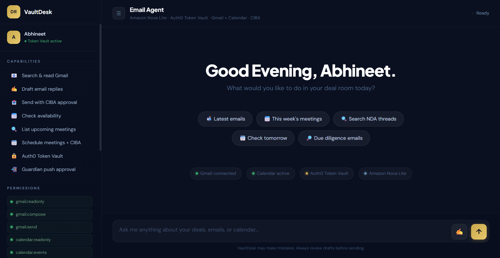

<div align="center">



# VaultDesk

**AI-powered M&A deal assistant with Gmail, Google Calendar, and Auth0 CIBA Guardian push approval**

[](https://devpost.com)
[](https://aws.amazon.com/bedrock)
[](https://auth0.com)
[](https://python.org)
[](https://fastapi.tiangolo.com)
[](https://dash.plotly.com)
[](https://langchain-ai.github.io/langgraph)

*Connect it to your Gmail and Calendar. Ask questions in plain English. Draft, send, and schedule — with Guardian push approval before anything goes out.*

</div>

---

## What it does

VaultDesk is an AI assistant built for M&A and business deal teams. It connects to your Gmail and Google Calendar via Auth0 Token Vault, runs a LangGraph agent on Amazon Nova Lite, and enforces a CIBA Guardian push notification approval step before any email is sent or meeting is created.

**Built for [Authorized to Act: Auth0 for AI Agents](https://devpost.com) · Track: Build an agentic AI application using Auth0 for AI Agents Token Vault**

---

## Demo

> 🎥 

---

## Stack

| Layer | Tech |
|---|---|
| Agent | LangGraph (`StateGraph` + `ToolNode`) |
| LLM | Amazon Nova Lite via AWS Bedrock (`ChatBedrockConverse`) |
| Auth | Auth0 Token Vault + CIBA Guardian push approval |
| Gmail | Gmail API (`gmail.readonly`, `gmail.compose`, `gmail.send`) |
| Calendar | Google Calendar API (`calendar.readonly`, `calendar.events`) |
| Backend | FastAPI + Uvicorn |
| Frontend | Plotly Dash + Dash Bootstrap Components |

---

## Setup

### 1. Clone and install

```bash
pip install -r requirements.txt
```

### 2. Environment variables

Copy `.env.example` to `.env` and fill in your values:

```bash
cp .env.example .env
```

| Variable | Description |
|---|---|
| `AUTH0_DOMAIN` | Your Auth0 tenant domain (e.g. `your-tenant.auth0.com`) |
| `AUTH0_CLIENT_ID` | Auth0 application client ID |
| `AUTH0_CLIENT_SECRET` | Auth0 application client secret |
| `SECRET_KEY` | Random secret for session middleware |
| `AWS_REGION` | AWS region for Bedrock (default: `us-east-1`) |
| `AWS_ACCESS_KEY_ID` | AWS access key |
| `AWS_SECRET_ACCESS_KEY` | AWS secret key |

### 3. Auth0 Dashboard configuration

- **Allowed Callback URLs**: `http://localhost:8001/auth/callback`
- **Allowed Logout URLs**: `http://localhost:8001`
- Enable **CIBA** on your Auth0 tenant
- Enable **Auth0 Guardian** push notifications
- Add **Google social connection** with Gmail + Calendar scopes

### 4. Run

```bash
python main.py
```

Open **http://localhost:8001**

---

## Project Structure

```
vaultdesk/
├── main.py                    # Entry point
├── config/
│   ├── settings.py            # Env vars
│   └── constants.py           # Scopes, prompts, templates
├── auth/
│   ├── auth0_client.py        # Auth0 setup
│   ├── google_token.py        # Token fetch from Auth0 Token Vault
│   └── ciba.py                # CIBA request + poll
├── services/
│   ├── llm_client.py          # Bedrock + LangChain LLM init
│   ├── google_services.py     # gmail_svc / cal_svc builders
│   └── email_parser.py        # Body + attachment extraction
├── tools/
│   ├── gmail_tools.py         # Gmail LangChain tools
│   ├── calendar_tools.py      # Calendar LangChain tools
│   └── registry.py            # TOOLS list (single import point)
├── agent/
│   ├── prompts.py             # SYSTEM_PROMPT
│   ├── graph.py               # LangGraph StateGraph
│   └── runner.py              # run_agent + conversation store
├── api/
│   ├── app.py                 # FastAPI init + Dash mount
│   ├── routes.py              # /api/chat, /api/me, /api/clear
│   └── session_store.py       # Token → user map
└── ui/
    ├── layout.py              # Dash app + full layout
    ├── components.py          # Bubbles, chips, markdown renderer
    └── callbacks.py           # All Dash callbacks
```

---

## Features

- **Search & read Gmail** — keyword search and full thread reading
- **Draft emails** — creates drafts in Gmail, never sends without approval
- **Send with Guardian** — Auth0 CIBA push notification on your phone before any send
- **Calendar availability** — check free/busy slots
- **Schedule meetings** — creates events with Guardian push approval
- **Compose modal** — UI panel with email templates

---

## Hackathon

**Authorized to Act: Auth0 for AI Agents** · Devpost  
Track: Build an agentic AI application using Auth0 for AI Agents Token Vault  
Tag: `#Auth0forAIAgents`

---

<div align="center">
Made with Amazon Nova Lite · Auth0 Token Vault · LangGraph · Plotly Dash
</div>